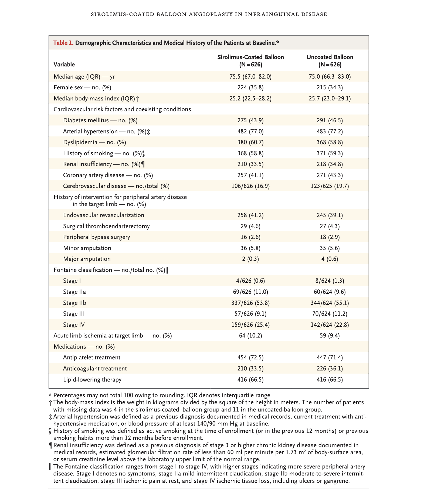

```{r setup, include=FALSE}
knitr::opts_chunk$set(
  collapse = TRUE,
  comment = "#>",
  warning = FALSE,
  message = FALSE,
  results = 'asis'
)

library(gt)
library(htmltools)

source("../R/table1.R")
source("../R/blueprint.R")
source("../R/validation_consolidated.R")
source("../R/dimensions.R")
source("../R/cells.R")
source("../R/themes.R")
source("../R/rendering.R")
source("../R/utils.R")
source("../R/spanners.R")
source("../R/summary_rows.R")

.builtin_themes <- .create_builtin_themes()
get_theme_registry <- function() .builtin_themes
```

```{r theme-css, results='asis', echo=FALSE}
if (knitr::is_html_output()) {
  theme_css <- generate_theme_css()
  cat("<style>\n")
  cat(theme_css)
  cat("\n</style>")
}
```

```{r helper, include=FALSE}
`%||%` <- function(x, y) if (is.null(x)) y else x

render_bp <- function(bp, theme_name = "nejm") {
  theme <- get_theme(theme_name)
  if (knitr::is_latex_output()) {
    output <- render_latex(bp, theme)
  } else if (knitr::is_html_output()) {
    output <- render_html(bp, theme)
  } else {
    output <- render_console(bp, theme)
  }
  knitr::asis_output(paste(output, collapse = "\n"))
}
```

## Target: Published NEJM Table

{width=100%}

## Overview

This vignette reproduces the visual style of a published NEJM
Table 1 (demographic and baseline characteristics) using both
the gt package and zztable1. The target is the table from
Langhoff et al., 'Sirolimus-Coated Balloon Angioplasty in
Infrainguinal Disease' (NEJM 2025).

## Simulated Data

The data below simulates the structure and approximate
proportions of the published table: a two-arm balloon
angioplasty trial with N=626 per group.

```{r data-setup, results='hide'}
set.seed(2025)
n_per_arm <- 626
n <- n_per_arm * 2

arm <- factor(
  rep(c("Sirolimus-Coated Balloon", "Uncoated Balloon"),
      each = n_per_arm)
)

make_binary <- function(p1, p2, n1 = n_per_arm,
                        n2 = n_per_arm) {
  factor(c(
    sample(c("Yes", "No"), n1, TRUE, c(p1, 1 - p1)),
    sample(c("Yes", "No"), n2, TRUE, c(p2, 1 - p2))
  ), levels = c("No", "Yes"))
}

trial <- data.frame(
  arm = arm,
  age = c(
    round(rnorm(n_per_arm, 75.5, 8.5), 1),
    round(rnorm(n_per_arm, 75.0, 8.8), 1)
  ),
  sex = factor(c(
    sample(c("Female", "Male"), n_per_arm, TRUE,
           c(0.358, 0.642)),
    sample(c("Female", "Male"), n_per_arm, TRUE,
           c(0.343, 0.657))
  ), levels = c("Female", "Male")),
  bmi = c(
    round(rnorm(n_per_arm, 25.2, 4.2), 1),
    round(rnorm(n_per_arm, 25.7, 4.4), 1)
  ),
  diabetes = make_binary(0.439, 0.465),
  hypertension = make_binary(0.770, 0.772),
  dyslipidemia = make_binary(0.607, 0.588),
  smoking = make_binary(0.588, 0.593),
  renal_insufficiency = make_binary(0.335, 0.348),
  cad = make_binary(0.411, 0.433),
  antiplatelet = make_binary(0.725, 0.714),
  anticoagulant = make_binary(0.335, 0.361),
  lipid_lowering = make_binary(0.665, 0.665)
)

trial$bmi[sample(which(trial$arm ==
  "Sirolimus-Coated Balloon"), 4)] <- NA
trial$bmi[sample(which(trial$arm ==
  "Uncoated Balloon"), 11)] <- NA
```

## gt Version

```{r gt-table, results='asis'}
calc_n_pct <- function(x) {
  n <- sum(x == "Yes", na.rm = TRUE)
  total <- sum(!is.na(x))
  pct <- round(100 * n / total, 1)
  paste0(n, " (", pct, ")")
}

calc_n_pct_level <- function(x, level) {
  n <- sum(x == level, na.rm = TRUE)
  total <- sum(!is.na(x))
  pct <- round(100 * n / total, 1)
  paste0(n, " (", pct, ")")
}

calc_median_iqr <- function(x) {
  x <- x[!is.na(x)]
  m <- round(median(x), 1)
  q <- round(quantile(x, c(0.25, 0.75)), 1)
  paste0(m, " (", q[1], "--", q[2], ")")
}

s1 <- trial[trial$arm == "Sirolimus-Coated Balloon", ]
s2 <- trial[trial$arm == "Uncoated Balloon", ]

rows <- data.frame(
  variable = c(
    "Median age (IQR) -- yr",
    "Female sex -- no. (%)",
    paste0("Median body-mass index (IQR)\u2020"),
    "Diabetes mellitus -- no. (%)",
    paste0("Arterial hypertension -- no. (%)\u2021"),
    "Dyslipidemia -- no. (%)",
    paste0("History of smoking -- no. (%)\u00a7"),
    paste0("Renal insufficiency -- no. (%)\u00b6"),
    "Coronary artery disease -- no. (%)",
    "Antiplatelet treatment",
    "Anticoagulant treatment",
    "Lipid-lowering therapy"
  ),
  scb = c(
    calc_median_iqr(s1$age),
    calc_n_pct_level(s1$sex, "Female"),
    calc_median_iqr(s1$bmi),
    calc_n_pct(s1$diabetes),
    calc_n_pct(s1$hypertension),
    calc_n_pct(s1$dyslipidemia),
    calc_n_pct(s1$smoking),
    calc_n_pct(s1$renal_insufficiency),
    calc_n_pct(s1$cad),
    calc_n_pct(s1$antiplatelet),
    calc_n_pct(s1$anticoagulant),
    calc_n_pct(s1$lipid_lowering)
  ),
  ub = c(
    calc_median_iqr(s2$age),
    calc_n_pct_level(s2$sex, "Female"),
    calc_median_iqr(s2$bmi),
    calc_n_pct(s2$diabetes),
    calc_n_pct(s2$hypertension),
    calc_n_pct(s2$dyslipidemia),
    calc_n_pct(s2$smoking),
    calc_n_pct(s2$renal_insufficiency),
    calc_n_pct(s2$cad),
    calc_n_pct(s2$antiplatelet),
    calc_n_pct(s2$anticoagulant),
    calc_n_pct(s2$lipid_lowering)
  ),
  stringsAsFactors = FALSE
)

gt_tbl <- rows |>
  gt(rowname_col = "variable") |>
  cols_label(
    scb = md("Sirolimus-Coated Balloon<br>(N=626)"),
    ub = md("Uncoated Balloon<br>(N=626)")
  ) |>
  tab_header(
    title = md(
      paste0("**Table 1.** Demographic Characteristics",
             " and Medical History of the Patients",
             " at Baseline.*")
    )
  ) |>
  tab_row_group(
    label = "Medications -- no. (%)",
    rows = c(
      "Antiplatelet treatment",
      "Anticoagulant treatment",
      "Lipid-lowering therapy"
    )
  ) |>
  tab_row_group(
    label = paste0(
      "Cardiovascular risk factors",
      " and coexisting conditions"
    ),
    rows = c(
      "Diabetes mellitus -- no. (%)",
      paste0("Arterial hypertension -- no. (%)\u2021"),
      "Dyslipidemia -- no. (%)",
      paste0("History of smoking -- no. (%)\u00a7"),
      paste0("Renal insufficiency -- no. (%)\u00b6"),
      "Coronary artery disease -- no. (%)"
    )
  ) |>
  tab_row_group(
    label = "",
    rows = c(
      "Median age (IQR) -- yr",
      "Female sex -- no. (%)",
      paste0("Median body-mass index (IQR)\u2020")
    )
  ) |>
  tab_source_note(md(paste0(
    "\\* Percentages may not total 100",
    " owing to rounding. IQR denotes",
    " interquartile range."
  ))) |>
  tab_source_note(md(paste0(
    "\u2020 The body-mass index is the weight in",
    " kilograms divided by the square of the",
    " height in meters. The number of patients",
    " with missing data was 4 in the",
    " sirolimus-coated-balloon group and 11",
    " in the uncoated-balloon group."
  ))) |>
  tab_source_note(md(paste0(
    "\u2021 Arterial hypertension was defined as",
    " a previous diagnosis documented in",
    " medical records, current treatment with",
    " antihypertensive medication, or blood",
    " pressure of at least 140/90 mm Hg at",
    " baseline."
  ))) |>
  tab_source_note(md(paste0(
    "\u00a7 History of smoking was defined as",
    " active smoking at the time of enrollment",
    " (or in the previous 12 months) or",
    " previous smoking habits more than",
    " 12 months before enrollment."
  ))) |>
  tab_source_note(md(paste0(
    "\u00b6 Renal insufficiency was defined as a",
    " previous diagnosis of stage 3 or higher",
    " chronic kidney disease documented in",
    " medical records, estimated glomerular",
    " filtration rate of less than 60 ml per",
    " minute per 1.73 m\u00b2 of body-surface",
    " area, or serum creatinine level above",
    " the laboratory upper limit of the",
    " normal range."
  ))) |>
  tab_options(
    table.font.size = px(13),
    table.font.names = c(
      "Arial", "Helvetica Neue", "sans-serif"
    ),
    heading.title.font.size = px(13),
    heading.title.font.weight = "normal",
    heading.background.color = "#f5f0e8",
    heading.border.bottom.color = "#c0b8a8",
    column_labels.font.weight = "bold",
    column_labels.border.top.color = "#5b5b5b",
    column_labels.border.top.width = px(2),
    column_labels.border.bottom.color = "#5b5b5b",
    column_labels.border.bottom.width = px(1),
    row_group.font.weight = "bold",
    row_group.border.top.color = "transparent",
    row_group.border.bottom.color = "transparent",
    table_body.border.top.color = "#5b5b5b",
    table_body.border.bottom.color = "#5b5b5b",
    table_body.border.bottom.width = px(2),
    table.border.top.color = "#5b5b5b",
    table.border.top.width = px(2),
    table.border.bottom.color = "#5b5b5b",
    table.border.bottom.width = px(2),
    table_body.hlines.color = "transparent",
    stub.border.color = "transparent",
    source_notes.font.size = px(11)
  ) |>
  opt_row_striping() |>
  tab_style(
    style = cell_fill(color = "#fefcf0"),
    locations = cells_body(
      rows = seq(2, nrow(rows), 2)
    )
  ) |>
  tab_style(
    style = cell_text(indent = px(16)),
    locations = cells_stub(
      rows = everything()
    )
  )

gt_tbl
```

## zztable1 Version

The zztable1 version uses the formula interface with
automatic computation. Note that zztable1 computes
statistics from raw data rather than requiring
pre-computed summary strings.

```{r zztable1-table}
bp <- table1(
  arm ~ age + sex + bmi + diabetes +
    hypertension + dyslipidemia + smoking +
    renal_insufficiency + cad +
    antiplatelet + anticoagulant +
    lipid_lowering,
  data = trial,
  theme = "nejm",
  pvalue = FALSE,
  footnotes = list(
    variables = list(
      bmi = paste(
        "The body-mass index is the weight in",
        "kilograms divided by the square of",
        "the height in meters."
      ),
      hypertension = paste(
        "Arterial hypertension was defined as",
        "a previous diagnosis documented in",
        "medical records, current treatment",
        "with antihypertensive medication, or",
        "blood pressure of at least 140/90",
        "mm Hg at baseline."
      ),
      smoking = paste(
        "History of smoking was defined as",
        "active smoking at the time of",
        "enrollment (or in the previous 12",
        "months) or previous smoking habits",
        "more than 12 months before",
        "enrollment."
      ),
      renal_insufficiency = paste(
        "Renal insufficiency was defined as",
        "a previous diagnosis of stage 3 or",
        "higher chronic kidney disease."
      )
    ),
    general = c(paste(
      "Percentages may not total 100",
      "owing to rounding. IQR denotes",
      "interquartile range."
    ))
  )
)

render_bp(bp, "nejm")
```

## Side-by-Side Comparison

### Features matched

| Feature | gt | zztable1 |
|:--------|:--:|:--------:|
| N= under column headers | Yes | Yes |
| Cream row striping | Yes | Yes |
| Horizontal-only rules | Yes | Yes |
| Symbol footnotes | Manual | Automatic |
| Compact row height | Yes | Yes |
| System sans-serif font | Yes | Yes |

### Differences

- **gt** required manual computation of all summary
  statistics (pre-computed data frame). **zztable1**
  computed them from the raw data via the formula
  interface.

- **gt** used `tab_row_group()` for section headers
  (e.g., 'Cardiovascular risk factors'). **zztable1**
  does not currently support mid-table section headers
  outside of the stratification system.

- **gt** offers finer control over individual cell
  styling (indent depth, per-row background). **zztable1**
  applies theme-level CSS uniformly.

- **gt** can show a title bar spanning the full table
  width. **zztable1** does not yet render table titles.
